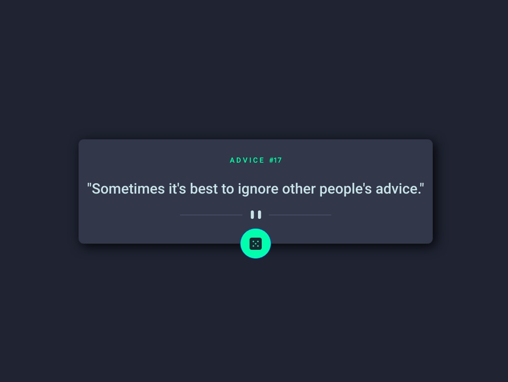

# Frontend Mentor - Advice generator app solution

This is a solution to the [Advice generator app challenge on Frontend Mentor](https://www.frontendmentor.io/challenges/advice-generator-app-QdUG-13db).

## Table of contents

- [Overview](#overview)
  - [The challenge](#the-challenge)
  - [Screenshot](#screenshot)
  - [Links](#links)
- [My process](#my-process)
  - [Built with](#built-with)
- [Author](#author)

## Overview

### The challenge

Users should be able to:

- Click on the dice and get a new, random, life advice.

### Screenshot

### Links

- Solution URL: https://your-solution-url.com
- Live Site URL: https://your-live-site-url.com

## My process

### Built with

- Semantic HTML5 markup
- CSS custom properties
- Flexbox
- CSS Grid
- Mobile-first workflow
- React Bootstrap
- [React](https://reactjs.org/) - JS library

## Author

- Frontend Mentor - [@maggioniduffy](https://www.frontendmentor.io/profile/maggioniduffy)
- Linkedin - [Faustino Maggioni Duffy](https://www.linkedin.com/in/maggioniduffy/)